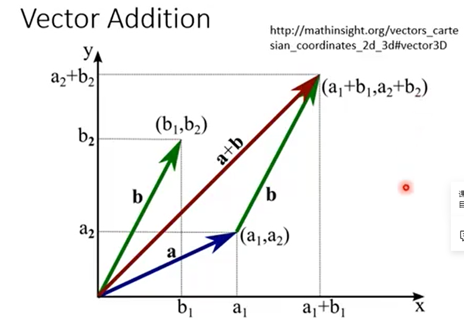

## 线性系统

两个条件：

- Persevering Multiplication：输入乘上k被 输出就乘上k倍
- Persevering Addition：种瓜得瓜种豆得豆


------

```
X→System→X²	不是线性系统（Linear）
```

------

```
6	9	→System→	6	8	9

8	0				9	0	2

9	2
将矩阵以左上到右下的对角线为轴进行翻转（Transpose）
是线性系统
```


------

```
function f → Derivative → function f'
输出f函数的导数
```


------

积分	是线性系统


## 微分方程、信号与系统

## 总览

1,2章	已有输出，检查有没有可实现的输入 是不是唯一解

3章	Determinant 行列式

4章	描述向量集合

5章	Eigen。。。

## 向量

### 各种定义

用一个粗体字表示**向量**（vector） 比如 **V**
$$
V=\begin{bmatrix}1 \\ 2 \\ 3 \end{bmatrix}
$$

**Components**：向量中的元素（1,2,3...） 用下标表示 比如 $ V_i $ ， $ V_2 = 3 $

如果向量只有2，3个Components 我们可以把它画在图中


**向量集合**：多个向量放在一起，集合中可以有无穷多个向量
$$
\begin{Bmatrix}
	\begin{bmatrix}1 \\ 2 \\ 3 \end{bmatrix},
	\begin{bmatrix}4 \\ 5 \\ 6 \end{bmatrix},
	\begin{bmatrix}7 \\ 8 \\ 9 \end{bmatrix}
\end{Bmatrix}
$$


**R^n^** ：把包含n个 Components 的向量集合起来

向量乘Scalar：


向量相加：




### 向量的八个特征

向量满足以下8个特征：假设3个向量**u**，**v**，**w** 属于 **R^n^** 并且 现有a，b两个数字

- **u** + **v** = **v** + **u**
- (**u** + **v**) + **w** = **u** + (**v** + **w**)
- 存在位于 **R^n^** 中的 **0 **向量使得 **0 ** + **u** = **u**      $ \mathbf0 = \begin{bmatrix}0 \\ \vdots \\ 0 \end{bmatrix} $
- 存在位于 **R^n^** 中的 **u' **向量使得 **u'** + **u** = **0** 
- 1**u** = **u**
- (ab)**u** = a(b**u**)
- a(**u**+**v**) = a**u** + a**v**
- (a+b)**u** = a**u** + b**u**

## 线性系统

System of Linear Equations 多元一次联立方程式


 

线性系统的每一个输出都是每一个输入的weight sum

证明过程：

 

**standard (unit) vector** 向量中只有一个数值是1 其他都是0，它是组成所有向量的 building block，将standard (unit) vector加加减减就能得到所有变量

$ \mathbf v = \begin{bmatrix}v_1 \\ v_2 \end{bmatrix} = v1 \begin{bmatrix}1 \\ 0 \end{bmatrix} + v2 \begin{bmatrix}0 \\ 1 \end{bmatrix} = v_1e_1 + v_2e_2 $

e~n~ -第n个数值为1 其他都是0


