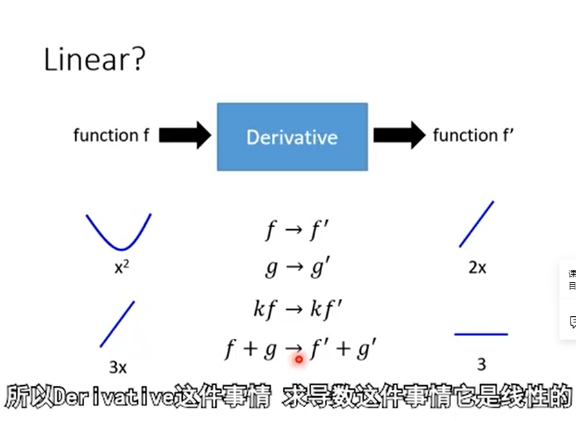
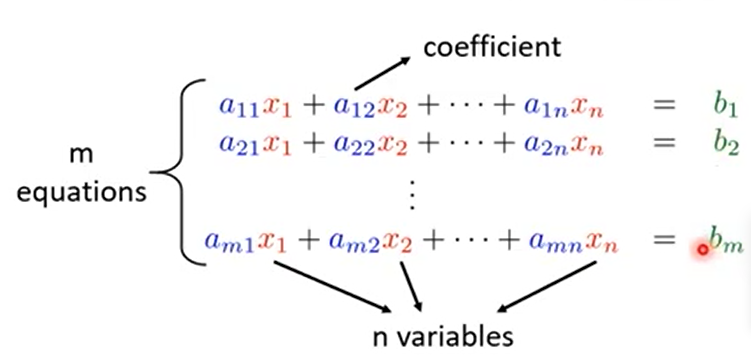
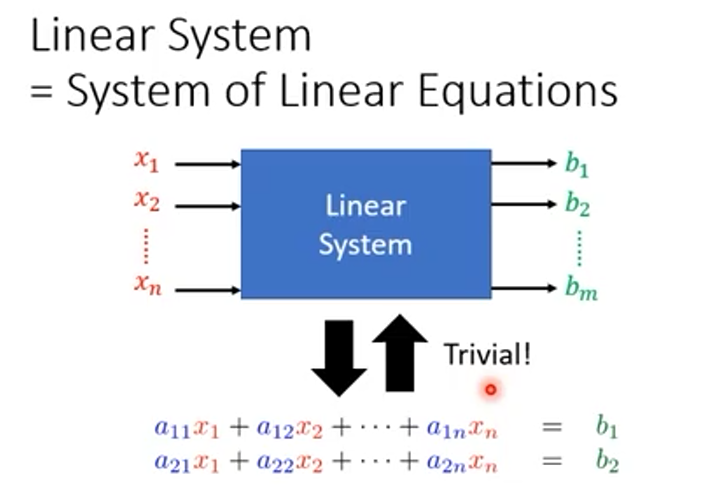
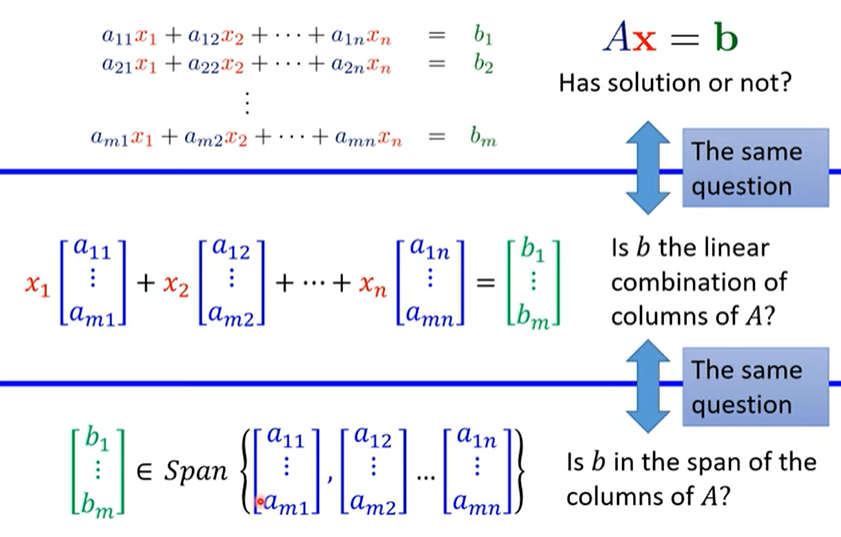

## 线性系统

两个条件：

- Persevering Multiplication：输入乘上k倍 输出就乘上k倍
- Persevering Addition：种瓜得瓜种豆得豆


------

```
X→System→X²	不是线性系统（Linear）
```

------

```
6	9	→System→	6	8	9

8	0				9	0	2

9	2
将矩阵以左上到右下的对角线为轴进行翻转（Transpose）
是线性系统
```


------

```
function f → Derivative → function f'
输出f函数的导数
```



------

积分	是线性系统


## 微分方程、信号与系统

## 总览

1,2章	已有输出，检查有没有可实现的输入 是不是唯一解

3章	Determinant 行列式

4章	描述向量集合

5章	Eigen。。。

## 向量

### 各种定义

用一个粗体字表示**向量**（vector） 比如 **V**
$$
V=\begin{bmatrix}1 \\ 2 \\ 3 \end{bmatrix}
$$

**Components**：向量中的元素（1,2,3...） 用下标表示 比如 $ V_i $ ， $ V_2 = 3 $

如果向量只有2，3个Components 我们可以把它画在图中


**向量集合**：多个向量放在一起，集合中可以有无穷多个向量
$$
\begin{Bmatrix}
	\begin{bmatrix}1 \\ 2 \\ 3 \end{bmatrix},
	\begin{bmatrix}4 \\ 5 \\ 6 \end{bmatrix},
	\begin{bmatrix}7 \\ 8 \\ 9 \end{bmatrix}
\end{Bmatrix}
$$


**R^n^** ：把包含n个 Components 的向量集合起来

向量乘Scalar：


向量相加：


### 向量的八个特征

向量满足以下8个特征：假设3个向量**u**，**v**，**w** 属于 **R^n^** 并且 现有a，b两个数字

- **u** + **v** = **v** + **u**
- (**u** + **v**) + **w** = **u** + (**v** + **w**)
- 存在位于 **R^n^** 中的 **0 **向量使得 **0 ** + **u** = **u**      $ \mathbf0 = \begin{bmatrix}0 \\ \vdots \\ 0 \end{bmatrix} $
- 存在位于 **R^n^** 中的 **u' **向量使得 **u'** + **u** = **0** 
- 1**u** = **u**
- (ab)**u** = a(b**u**)
- a(**u**+**v**) = a**u** + a**v**
- (a+b)**u** = a**u** + b**u**

## 线性系统

System of Linear Equations 多元一次联立方程式



 

线性系统的每一个输出都是每一个输入的weight sum

证明过程：

 

**standard (unit) vector** 向量中只有一个数值是1 其他都是0，它是组成所有向量的 building block，将standard (unit) vector加加减减就能得到所有变量

$ \mathbf v = \begin{bmatrix}v_1 \\ v_2 \end{bmatrix} = v1 \begin{bmatrix}1 \\ 0 \end{bmatrix} + v2 \begin{bmatrix}0 \\ 1 \end{bmatrix} = v_1e_1 + v_2e_2 $

e~n~ -第n个数值为1 其他都是0


## 矩阵

矩阵（Matrix）用大写字母表示（教程里说矩阵M要写为花体字 但是Markdown没有这么细致的字体 故作罢，但是不得到不说 Markdown的公式真是阴间

例：$ A = \begin{bmatrix}1 & -2 \\ 2 & -3 \\ 3 & -4 \end{bmatrix}$  

- 假设一个矩阵有m行(row) n列(columns)，我们称它的大小为m by n 或者写作 m x n
- 我们常用 M~mxn~ 来表示所有大小为m x n 矩阵的集合

  2 rows 3 columns

  $ \begin{bmatrix}1 & -2 \\ 2 & -3 \\ 3 & -4 \end{bmatrix} \in M_{3×2} $  

  $ \begin{bmatrix}1 & 2 & 3 \\ 4 & 5 & 6 \end{bmatrix} \in M_{2×3} $


  向量也可以称为矩阵

- 矩阵中成员的位置描述：矩阵中的第i行（row） 第j列（column）对应的元素被称为 (i,j)-entry

  $ A = \begin{bmatrix}2 & 3 & 5 \\ 3 & 1 & -1 \\ -2 & 1 & 1 \end{bmatrix} $ 

  

  将每一个column视为一个向量，矩阵就相当于把N个向量排在一起的矩阵

- 如果两个矩阵大小相同 就可以了相加或相减

  $ A = \begin{bmatrix}1 & 4 \\ 2 & 5 \\ 3 & 6 \end{bmatrix}$ $ B = \begin{bmatrix}6 & 9 \\ 8 & 0 \\ 9 & 2 \end{bmatrix}$
  
  $ A + B = \begin{bmatrix}7 & 13 \\ 10 & 5 \\ 12 & 8 \end{bmatrix}$ $ A - B = \begin{bmatrix}-5 & -5 \\ -6 & 5 \\ -6 & 4 \end{bmatrix}$
  
  $ 9B = \begin{bmatrix}54 & 81 \\ 72 & 0 \\ 81 & 18 \end{bmatrix}$

### 矩阵特性

现有A,B,C三个mxn的矩阵和s,t两个数(Scalar)则

- A + B = B + A
- (A + B) + C = A + (B + C)
- (st)A = s(tA)
- s(A + B) = sA + sB
- (s+t)A = sA + tA

### 有名有姓的Matrix

- Square matrix 对角线位置叫做diagonal，只有m=n时才有diagonal
- Upper Triangular Matrix 
- Lower Triangular Matrix
- Diagonal Matrix对角线以外的位置都是0
- Identity Matrix  $ I_3 = \begin{bmatrix}1 & 0 & 0 \\ 0 & 1 & 0 \\ 0 & 0 & 1 \end{bmatrix}$ 对角线以外的位置都是0且对角线以内的位置都是1，一般用 I 或者I~n~ 来表示
- Zero Matrix  $ O_{2×3} = \begin{bmatrix}0 & 0 & 0 \\ 0 &0 & 0 \end{bmatrix}$  所有的成员都是0 用O或者O~mxn~ 来表示

### Transpose(翻转)

现有一个mxn的矩阵A，用A^T^ 表示对A进行transpose的结果。A^T^ 为一个nxm的矩阵，原来在A中位置为(i,j)的元素(entry) 在A^T^ 中位置为(j,i)。即把Column变成Row；Row变成Column

$ A = \begin{bmatrix}6 & 9 \\ 8 & 0 \\ 9 & 2 \end{bmatrix} → A^T = \begin{bmatrix}6 & 8 & 9 \\ 9 & 0 & 2 \end{bmatrix}$ 

### Transpose特性

假设有A 和 B 两个mxn的矩阵，s为一个数值(scalar)

- ( A^T^ )^T^ = A 
- (sA)^T^ = sA^T^
- (A+B)^T^ = A^T^ + B^T^

Symmetric Matrix(对称矩阵) A^T^ = A

$ A = \begin{bmatrix}1 & 2 & 4 \\ 2 & 3 & -1 \\ 4 & -1 & 5 \end{bmatrix} = A^T $

## 矩阵和向量的相乘

inner Product(内积)

### 从row的角度看待


矩阵中的每个Row分别与向量x做inner Product(内积)。也就是A中每个row中的entry数量需要等于x中的entry数量

$ A = \begin{bmatrix}1 & 2 & 3 \\ 4 & 5 & 6 \end{bmatrix} $   $ x = \begin{bmatrix}1 \\ 2 \\ 3 \end{bmatrix} $   $ Ax =  \begin{bmatrix}14 \\ 32 \end{bmatrix}$

### 从Column的角度看待


可以看做将一个x输入一个线性系统，然后输出一个矩阵A乘以这个向量x


矩阵A代表了这个系统，这个系统会进行什么操作，是由矩阵A决定的

例：向量$ x = \begin{bmatrix}-2 \\ 0.5 \end{bmatrix} $ 矩阵 $A = \begin{bmatrix}1 & 4 \\ -3 & 2 \end{bmatrix} $ 

Ax = $ \begin{bmatrix}1×(-2)+4×0.5 \\ (-3)×(-2)+2×0.5  \end{bmatrix} $   = $ (-2)× \begin{bmatrix}1 \\ -3 \end{bmatrix} + 0.5×\begin{bmatrix}4 \\ 2 \end{bmatrix}$ = $ \begin{bmatrix}-2 \\ 6 \end{bmatrix} + \begin{bmatrix}2 \\ 1 \end{bmatrix}$ = $ \begin{bmatrix}0 \\ 7 \end{bmatrix} $


### 特性

向量和矩阵必须相匹配时才能相乘


现有A和B两个mxn的矩阵，**u**和**v**两个为**R^n^**的向量 ，c为数值

- A( **u** + **v** ) = A**u** + A**v**
- A( c**u** ) = c( A**u** ) = ( cA )**u**
- ( A + B )**u** = A**u** + B**u**
- A**0** = **0** 	0向量乘以A也会是0向量
- O**v** = **0**	0矩阵(Zero Matrix)乘以任何向量 结果都是0向量
- I~n~ **v** = **v**    Identity Matrix 乘以**v**向量 结果为**v**

 判断矩阵是否相同：A**w** = B**w** 对所有向量**w**生效

A**e**~j~ = **a~j~** ，**e**~j~ 是第j个standard vector向量在R^n^中时 即**e**~j~是第j个数值为1，其他数值为0 ，共有n个数值的向量

**e~1~** = $ \begin{bmatrix}1 \\ \vdots \\ 0 \end{bmatrix} $ A**e~1~** = $ \begin{bmatrix}a_1 \cdots a_n \end{bmatrix}\begin{bmatrix}1 \\ \vdots \\ 0 \end{bmatrix}  $ = 1 · **a~1~** + 0 · **a~2~** + ... + 0 · **a~n~** = **a~1~** 

如果想知道矩阵的第n个元素是什么，可以将它乘上对应的standard vector

A**e~1~** = B**e~1~** → **a1 = b1**

A**e~2~** = B**e~2~** → **a2 = b2**

A**e~n~** = B**e~n~** → **an = bn**

所以 A = B

即n个standard vector输入A和B两个Linear System 得到的结果都一样 即可判断A = B


## 线性方程组

A**x** = b

已知 A 和 b 求得 x

a~11~x~1~ + a~12~x~2~ = b~1~ ...... line1

a~21~x~1~ + a~22~x~2~ = b~2~ ...... line1


有唯一解，没有解（inconsistent），有无穷多解

为什么不能只有2个解？ 一个线性系统只要能找到2个解 就能找到无穷多解

**x**?→A→**b**

**u**→A→**b**	**v**→A→**b**

0.3**u**→A→0.3**b**	0.7**v**→A→0.7**b**

0.3**u** + 0.7**v**→A→0.3**b**+0.7**b** =b	第三个解...无穷多解

------

A**x** = b

A：mxn **x**∈R^n^ b∈R^m^ 判断是否有解

等价于

**b**是不是A这个矩阵的列的线性组合（即矩阵A的列数是否等于向量b中的entry数量）

等价于

**b**是不是在矩阵A的列的span里

如果是则有解

如果A的列是independent 独立的 /矩阵A的Rank=n / 矩阵A的Nullity =0 则有唯一解

如果A的列是dependent 非独立的 /矩阵A的Rank<n / 矩阵A的Nullity >0 则有无穷多解

n为矩阵A包含的元素数目


## Linear Combination（线性组合）

假设有一个向量集{ **u~1~** , **u~2~** ,···, **u~k~** }

**v** = c~1~ **u~1~** + c~2~ **u~2~** + ··· + c~k~ **u~k~**  这个相乘再相加的过程被称为 Linear Combination （线性组合）

c1,c2,···,c~k~ 叫做 Linear Combination 的 combination（系数）

向量集：$\left.\begin{cases}\begin{matrix} \begin{bmatrix}1 \\ 1 \end{bmatrix},\begin{bmatrix}1 \\ 3 \end{bmatrix},\begin{bmatrix}1 \\ -1 \end{bmatrix} \end{matrix}\end{cases} \right\}$

系数（corfficients）：{-3,4,1}

Linear Combination结果：$ -3\begin{bmatrix}1 \\ 1 \end{bmatrix}+4\begin{bmatrix}1 \\ 3 \end{bmatrix}+\begin{bmatrix}1 \\ -1 \end{bmatrix} $ = $ \begin{bmatrix}2 \\ 8 \end{bmatrix} $

也就是把向量进行 weighted sum


System of Linear Equations可以写作矩阵与向量相乘


Ax =b  System of Linear Equations是否有解 等同于 b 是A的列的 Linear Combination 吗？如果是，则有解

Ax = x~1~a~1~ + x~2~a~2~ + ... + x~n~a~n~ 

**例1：**

3x~1~ + 6x~2~ = 3

2x~1~ +4x~2~ = 4

是否有解？

Ax = b

A = $ \begin{bmatrix} 3 & 6 \\ 2 & 4 \end{bmatrix} $ x = $ \begin{bmatrix} x_1 \\ x_2 \end{bmatrix} $ b = $ \begin{bmatrix} 3 \\ 4 \end{bmatrix} $ 

 $ \begin{bmatrix} 3 \\ 4 \end{bmatrix} $ 能否由 $\left.\begin{cases}\begin{matrix} \begin{bmatrix}3 \\ 2 \end{bmatrix},\begin{bmatrix}6 \\ 4 \end{bmatrix}\end{matrix}\end{cases} \right\}$ 通过 Linear Combination 得到


 Linear Combination 后只能得到这条直线，而 $ \begin{bmatrix} 3 \\ 4 \end{bmatrix} $ 不在这条直线上，所以无解

**例2：**

2x~1~ + 3x~2~ = 4

3x~1~ +1x~2~ = -1

是否有解？

Ax = b

A = $ \begin{bmatrix} 2 & 3 \\ 3 & 1 \end{bmatrix} $ x = $ \begin{bmatrix} x_1 \\ x_2 \end{bmatrix} $ b = $ \begin{bmatrix} 4 \\ -1 \end{bmatrix} $ 

 $ \begin{bmatrix} 4 \\ -1 \end{bmatrix} $ 能否由 $\left.\begin{cases}\begin{matrix} \begin{bmatrix}2 \\ 3 \end{bmatrix},\begin{bmatrix}3 \\ 1 \end{bmatrix}\end{matrix}\end{cases} \right\}$ 通过 Linear Combination 得到


 Linear Combination 后可以得到这条直线，而 $ \begin{bmatrix} 4 \\ -1 \end{bmatrix} $ 在这条直线上，所以有解

如果两个非平行的二维向量可以通过 Linear Combination 组成任何二维向量

**结论**：如果 **u** 和 **v** 是任意非平行的两个二维向量，通过 Linear Combination 可以组成任何二维向量

如果两个二维向量可以组成某个二维向量，不代表这两个二维向量是非平行的

如果 **u** 、 **v** 、 **w** 是任意非平行的三个三维向量 不代表可以组成任意的三维向量，因为这三个向量可能是共平面的

**例3：**

2x~1~ + 6x~2~ = -4

1x~1~ +3x~2~ = -2

是否有解？

Ax = b

A = $ \begin{bmatrix} 2 & 6 \\ 1 & 3 \end{bmatrix} $ x = $ \begin{bmatrix} x_1 \\ x_2 \end{bmatrix} $ b = $ \begin{bmatrix} -4 \\ -2 \end{bmatrix} $ 

 $ \begin{bmatrix} -4 \\ -2 \end{bmatrix} $ 能否由 $\left.\begin{cases}\begin{matrix} \begin{bmatrix}2 \\ 6 \end{bmatrix},\begin{bmatrix}1 \\ 3 \end{bmatrix}\end{matrix}\end{cases} \right\}$ 通过 Linear Combination 得到？可以


## Span

现有一个向量集合 S = {**u~1~**,**u~2~**,...,**u~k~**,}

这个向量集合的所有向量拿出来做 Linear Combination 得到的结果的集合即为Span 里面可以有无穷多向量

Span S = {c~1~ **u~1~** + c~2~ **u~2~** +...+ c~k~ **u~k~** | 乘上所有c~1~,c~2~,...,c~k~} 

向量集V = Span S

S是V的 generating set  或者 S generating（产生） 了 V

用无限元描述向量集的一种方法 （One way to describe a vector set with infinite elements）


现有向量集S~0~ = { $ \begin{bmatrix} 0 \\ 0 \end{bmatrix} $ } 求 Span S~0~

Span S~0~ = {$ \begin{bmatrix} 0 \\ 0 \end{bmatrix} $} 因为 C~1~ $ \begin{bmatrix} 0 \\ 0 \end{bmatrix} $ = $ \begin{bmatrix} 0 \\ 0 \end{bmatrix} $ 

现有向量集S~1~ = { $ \begin{bmatrix} 1 \\ -1 \end{bmatrix} $ } 求 Span S~1~

Span S~1~= {$ \begin{bmatrix} 1 \\ -1 \end{bmatrix},\begin{bmatrix} 2 \\ -2 \end{bmatrix},\begin{bmatrix} -1 \\ 1 \end{bmatrix},...... $} 可组成一条直线

如果S里包含非0向量，那Span S就会包含无穷多个向量


现有S~2~ = { $ \begin{bmatrix} 1 \\ -1 \end{bmatrix},\begin{bmatrix} -2 \\ 2 \end{bmatrix} $ } 求Span S~2~  

也就是说即使两个向量集所包含的向量不同，Span S~1~ 也有可能等于 Span S~2~

现有S~3~ = { $ \begin{bmatrix} 1 \\ -1 \end{bmatrix},\begin{bmatrix} -2 \\ 2 \end{bmatrix},\begin{bmatrix} 2 \\ 1 \end{bmatrix} $ } 求Span S~3~ 

二维平面上两个非平行向量可以组合出所有二维向量，也就是Span S~3~可以铺满平面 即Span S~3~ = R^2^

现有S~4~ = { $ \begin{bmatrix} 1 \\ -1 \end{bmatrix},\begin{bmatrix} -2 \\ 2 \end{bmatrix},\begin{bmatrix} 2 \\ 1 \end{bmatrix},\begin{bmatrix} -1 \\ 3 \end{bmatrix} $ } 求Span S~4~ 

总结：b有没有在A的columns 的 span里 如果落在 则有解 没有落在则没有解



现有二维矩阵A $ \begin{bmatrix} 1 & -2 & 2 \\ -1 & 2 & 1 \end{bmatrix} $ ，二维向量 b $ \begin{bmatrix} 1 \\ 2 \end{bmatrix} $ 求一个x 使得 Ax = b

可以转换为以下叙述：现有向量集S~3~ = { $ \begin{bmatrix} 1 \\ -1 \end{bmatrix},\begin{bmatrix} -2 \\ 2 \end{bmatrix},\begin{bmatrix} 2 \\ 1 \end{bmatrix} $ }  求Span S~3~ 并且b是否落在 Span S~3~里？

因为Span S~3~ = R^2^ 所以二维向量b一定落在Span S~3~里 所以x有解 且b为任何值都会有解


在S~3~中拿掉$ \begin{bmatrix} 1 \\ -1 \end{bmatrix},\begin{bmatrix} -2 \\ 2 \end{bmatrix} $ 其中一个不会影响Span后的Vector Set 也就是其中一个是多余的

假设现有S = {u~1~ , u~2~ ··· u~k~ , v}

假设现有S' = {u~1~ , u~2~ ··· u~k~}

【如果Span S ⇌ Span S' 则向量v是多余的】 ⇌ 【v是S其余成员的linear combination (v ∈ Span S')】

w ∈ Span S 

w ∈ Span S‘

等价于

如果某个向量w在Span S里就一定在Span S’里，且反过来也成立 则Span S = Span S' 

### 【如果Span S ⇌ Span S' 则向量v是多余的】 ← 【v是S其余成员的linear combination (v ∈ Span S')】

v = b~1~u~1~ + b~2~u~2~ + ··· + b~k~u~k~

------

证明 w ∈ Span S → w ∈ Span S'

w ∈ Span S

↓

w = c~1~u~1~ + c~2~u~2~ + ··· + c~k~u~k~ + cv

=(c~1~ + cb~1~)u~1~ + (c~2~ + cb~2~)u~2~ + ··· +(c~k~ + cb~k~)u~k~

↓

w = c~1~u~1~ + c~2~u~2~ + ··· + c~k~u~k~

↓

w ∈ Span S'

------

证明 w ∈ Span S' → w ∈ Span S

w ∈ Span S'

↓

w = c~1~u~1~ + c~2~u~2~ + ··· + c~k~u~k~

=c~1~u~1~ + c~2~u~2~ + ··· + c~k~u~k~ + cv	(此时c=0)

↓

w ∈ Span S

### 【如果Span S ⇌ Span S' 则向量v是多余的】 → 【v是S其余成员的linear combination (v ∈ Span S')】

Span S ⇌ Span S'

v = 0u~1~ + 0u~2~ + ··· + 0u~k~ + 1v 

v∈Span S → v∈Span S'